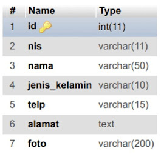

# PWEB-9-Upload-File

Repository ini menampung tugas kesembilan mata kuliah pemrograman web yang berupa
website CRUD di mana *user* dari website bisa meng-upload data ke server termasuk
data binary seperti file. Selain meng-upload, user juga bisa meng-edit data yang
telah ia kirim ke server dan juga bisa menghapus datanya dari server.
Repository ini dikerjakan dan dimiliki oleh:

| Nama | NRP |
|------|-----|
| Richie Seputro | 5025211213 |

Pengguna dimohon untuk menggunakan sebuah *web server* yang mendukung PHP serta
database MySQL atau MariaDB.

Untuk skema database-nya sendiri adalah sebagai berikut:

Silakan mengubah file `config.php` untuk menggunakan kredensial MySQL / MariaDB
yang lain maupun untuk mengubah detil-detil dari database.